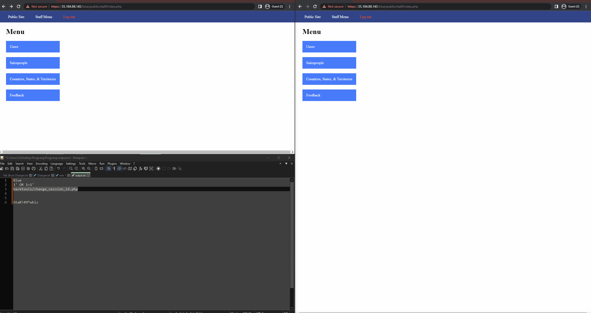
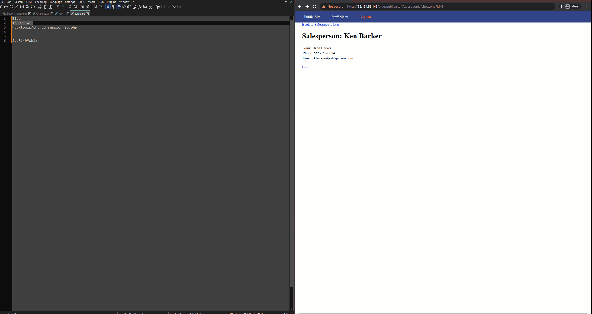
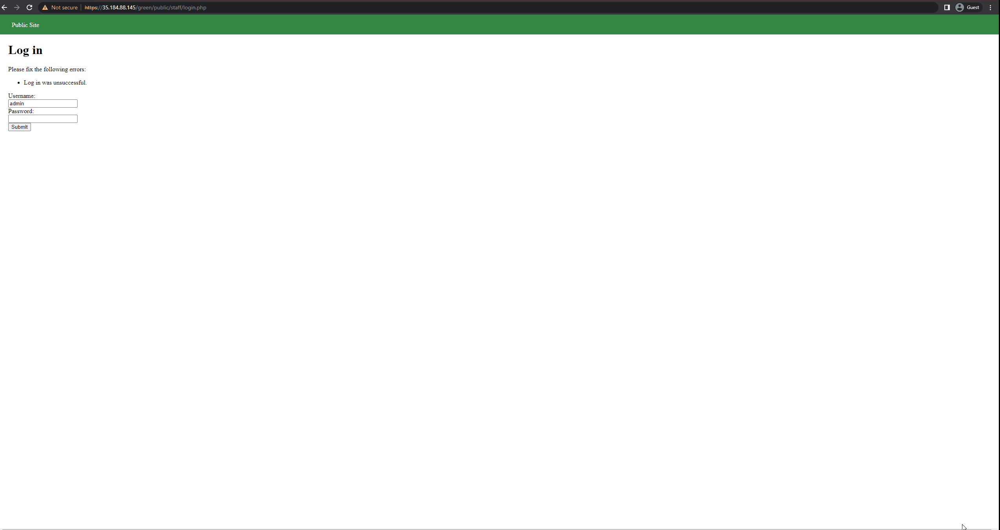
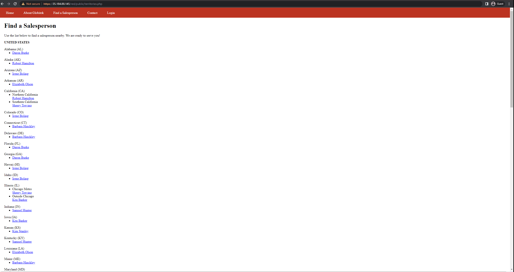

# Unit-9-Project-Pen-Testing-Live-Targets
CodePath Assignmnet

Time spent: **1** hours spent in total

> Objective: Identify vulnerabilities in three different versions of the Globitek website: blue, green, and red.

The six possible exploits are:

* Username Enumeration
* Insecure Direct Object Reference (IDOR)
* SQL Injection (SQLi)
* Cross-Site Scripting (XSS)
* Cross-Site Request Forgery (CSRF)
* Session Hijacking/Fixation

Each color is vulnerable to only 2 of the 6 possible exploits. First discover which color has the specific vulnerability, then write a short description of how to exploit it, and finally demonstrate it using screenshots compiled into a GIF.

## Blue

Vulnerability #1: Session Hijacking

Description: Using the tool provided by code path, An attaker can hijack victim's session ID and get into victim's account without proper authorization and verification. 

## Blue

Vulnerability #1.2: Exposed SQLi query

Description: Instead of using the correct Salesperson's ID number, the attacker can injected a SQL command. Steps are shown in the gif. 

## Green

Vulnerability #1: User Enumaration

Description: The Green Website exhibits a Username Enumeration error, as evidenced by the varying login failure messages for existing and non-existent usernames, as shown below.

## Red

Vulnerability #1: Insecure Direct Object Reference (IDOR)

Description: By manipulating the ID value, the attacker can gain unauthorized access to hidden user accounts that would otherwise be inaccessible.

## Notes

Describe any challenges encountered while doing the work
